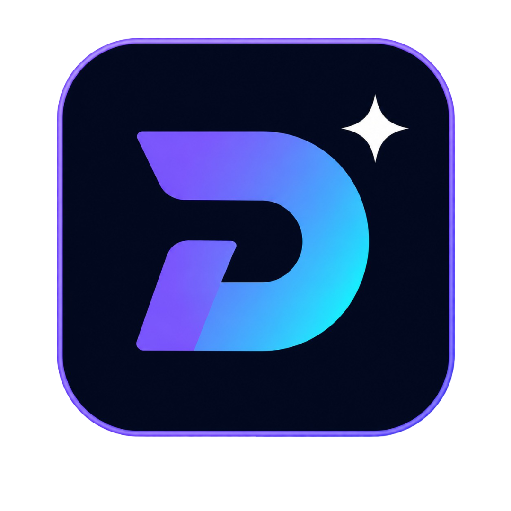
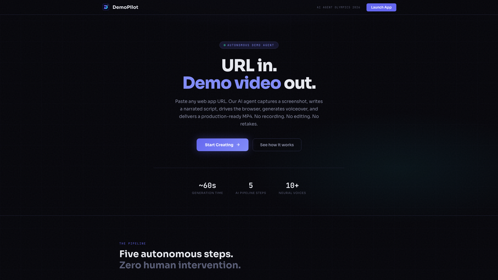
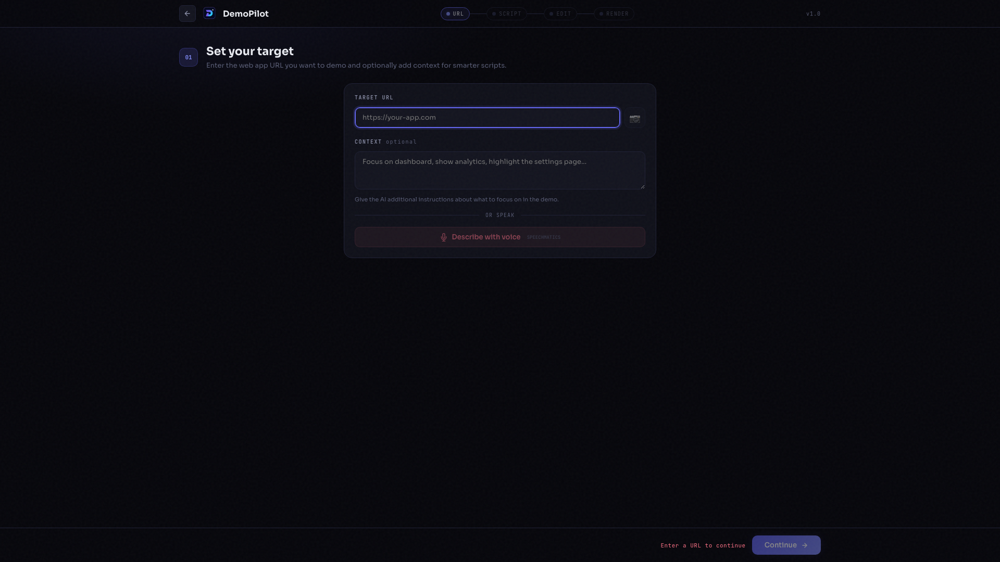
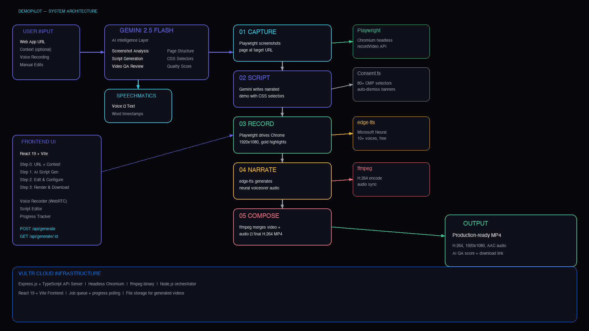

# DemoPilot — Autonomous Demo Video Agent

<p align="center">
  
</p>

**URL in. Demo video out.** DemoPilot is a fully autonomous AI agent that generates production-ready narrated demo videos from any web application URL in ~60 seconds. No screen recording, no editing, no retakes.

> **Try it live:** The app is deployed on Vultr and ready to use — just paste a URL and hit generate. The instance includes $5 of Gemini API credits pre-loaded, so it works out of the box. See [Live Demo](#live-demo) below.

<p align="center">
  
</p>

## How It Works

```
URL → Gemini Analyzes Page → Playwright Records Browser → edge-tts Narrates → ffmpeg Renders MP4
```

### 5-Step Autonomous Pipeline

1. **Capture** — Playwright navigates to the target URL, captures a screenshot, and extracts the page structure (nav links, buttons, headings, form fields)
2. **Script** — Gemini 3 Flash analyzes the screenshot + page elements and writes a narrated demo script with precise browser actions (click, hover, type, scroll, navigate) using real CSS selectors
3. **Record** — Playwright drives headless Chromium at 1920×1080 with retina quality, gold highlight glows on clicks, smooth scrolling, visible cursor tracking, and character-by-character typing
4. **Narrate** — edge-tts generates neural voiceover (Microsoft Azure voices, 10+ options) timed to each segment
5. **Compose** — ffmpeg merges recording + narration into a final H.264 MP4

### Voice-to-Script (Speechmatics)

Speak your demo intent into a microphone. Speechmatics transcribes your voice in real-time, then Gemini converts the transcript into a structured demo script. No typing required.

### AI Quality Assurance

After rendering, Gemini extracts frames from the output video and reviews them for content quality, visual fidelity, and flow — scoring 1-10 with specific issue callouts.

## Tech Stack

| Layer | Technology | Role |
|-------|-----------|------|
| Script Intelligence | **Google Gemini 3 Flash** | Screenshot analysis, script generation, video QA |
| Voice Transcription | **Speechmatics** | Real-time voice-to-text for voice-driven scripting |
| Browser Automation | **Playwright** | Headless Chrome recording at 1920×1080 with retina |
| Text-to-Speech | **edge-tts** | Microsoft Azure Neural voices (10+ options) |
| Video Composition | **ffmpeg** | H.264 MP4 rendering with audio sync |
| Backend | **Node.js + Express + TypeScript** | API server, pipeline orchestration |
| Frontend | **React + Vite + TypeScript** | Step-wizard UI with voice recording |
| Deployment | **Vultr** | Cloud VM with headless Chromium + ffmpeg |

## Live Demo

DemoPilot is deployed on a Vultr VM and available to try right now. The instance comes pre-loaded with $5 of Google Gemini API credits, so you can generate real demo videos immediately — no setup, no API keys, no configuration. Just open the link, paste any web app URL, and watch the autonomous pipeline produce a narrated MP4 in about 60 seconds.

| | URL |
|---|---|
| **HTTPS** | [https://representative-celebrity-locator-greene.trycloudflare.com](https://representative-celebrity-locator-greene.trycloudflare.com) |
| **HTTP** | [http://45.76.17.96](http://45.76.17.96) |

> **Note:** The HTTPS Cloudflare tunnel URL may change on server restart. The HTTP IP is stable.

## Exported Demos

All videos below were generated entirely by DemoPilot — from URL to finished MP4, untouched by human hands. Find them in the [`demos/`](demos/) directory:

| Demo | Source App | File |
|------|-----------|------|
| **AgentShield** | AI security threat dashboard | [`demos/agentshield_demo.mp4`](demos/agentshield_demo.mp4) |
| **Meridian** | LC intelligence platform | [`demos/meridian_demo_final.mp4`](demos/meridian_demo_final.mp4) |
| **Cognee** | Knowledge management platform | [`demos/cognee_demo.mp4`](demos/cognee_demo.mp4) |

## Setup

### Prerequisites

- Node.js 18+
- ffmpeg (`brew install ffmpeg`)
- edge-tts (`pip install edge-tts`)
- Playwright browsers (`npx playwright install chromium`)

### Installation

```bash
# Clone
git clone https://github.com/YoussefMadkour/DemoPilot.git
cd DemoPilot

# Backend
cd backend
npm install
cp .env.example .env
# Add your GEMINI_API_KEY and SPEECHMATICS_API_KEY to .env
npx playwright install chromium
npm run dev

# Frontend (new terminal)
cd frontend
npm install
npm run dev
```

### Environment Variables

```
GEMINI_API_KEY=your_google_ai_studio_key
SPEECHMATICS_API_KEY=your_speechmatics_key  # optional, for voice input
PORT=3002
```

## Usage

<p align="center">
  
</p>

1. Open `http://localhost:5173`
2. **Step 1 — URL**: Paste any web app URL, optionally add context hints
3. **Step 2 — Script**: Click "Generate Script with AI" or describe with voice (Speechmatics)
4. **Step 3 — Edit**: Fine-tune narration text, adjust browser actions, pick a narrator voice
5. **Step 4 — Render**: Hit "Generate Demo Video" and watch the pipeline run

## API Endpoints

| Method | Endpoint | Description |
|--------|----------|-------------|
| `POST` | `/api/scripts` | Generate script from URL (Gemini + screenshot) |
| `POST` | `/api/scripts/voice` | Voice-to-script (Speechmatics + Gemini) |
| `POST` | `/api/scripts/screenshot` | Capture URL screenshot |
| `POST` | `/api/generate` | Start video generation pipeline |
| `GET` | `/api/generate/:id` | Poll job status |
| `GET` | `/api/generate/:id/download` | Download final MP4 |
| `GET` | `/api/voices` | List available TTS voices |
| `GET` | `/api/voices/:id/preview` | Preview a voice sample |

## Architecture

<p align="center">
  
</p>

## Hackathon Tracks

- **Agentic Workflows** — Autonomous 5-step pipeline with zero human intervention
- **Enterprise Utility** — Every SaaS company needs demo videos; current process takes 2-4 hours
- **Multimodal Intelligence** — Screenshot analysis, voice input, video output

## Built for AI Agent Olympics 2026

Milan AI Week — May 13–20, 2026

**Technology Partners:** Google Gemini, Speechmatics, Vultr

## License

MIT
